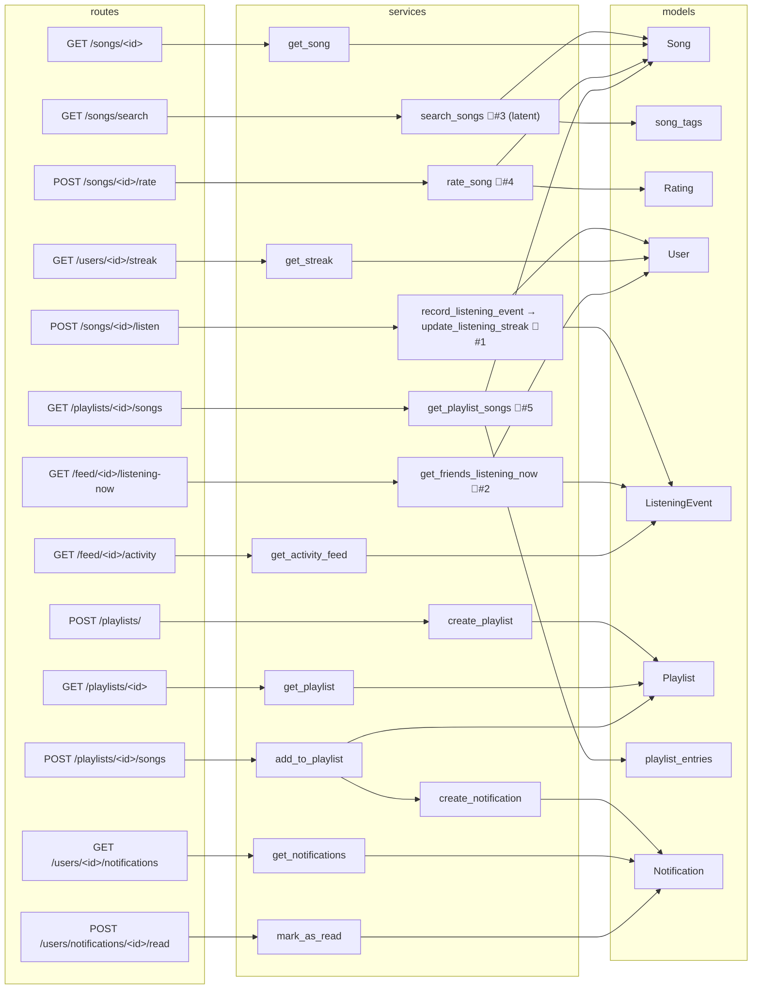

# Mixtape Bug Hunt — Findings Report

Traced each open issue from its **route → service → model** call chain, as the README
prescribes. Each finding below records the entry point, the exact defect, root cause, and how
it was verified. Test results are from `pytest tests/` (**3 failed, 10 passed**).

---

## Dependency graph (route → service → model)

Every HTTP endpoint is a thin blueprint that delegates to one service function. The services
own all business logic and DB access. Nodes marked 🐛 sit on a path with a defect.



Text form of the buggy chains:

```
POST /songs/<id>/listen  → streak_service.record_listening_event
                             → update_listening_streak()          🐛 #1
POST /songs/<id>/rate    → notification_service.rate_song()       🐛 #4  (never calls create_notification)
GET  /songs/search       → search_service.search_songs()          🐛 #3  (latent — see below)
GET  /playlists/<id>/songs → playlist_service.get_playlist_songs() 🐛 #5
GET  /feed/<id>/listening-now → feed_service.get_friends_listening_now() 🐛 #2
```

---

## Findings

### Issue #1 — Listening streak keeps resetting  ·  CONFIRMED (test fails)
- **Chain:** `POST /songs/<id>/listen` → `record_listening_event` → `update_listening_streak`
- **File:** `services/streak_service.py:73`
- **Defect:** the consecutive-day branch is gated on `days_since_last == 1 and today.weekday() != 6`.
  The `and today.weekday() != 6` clause means when *today* is a Sunday, a legitimate
  consecutive-day listen falls through to the `else` and resets the streak to 1.
- **Root cause:** a spurious day-of-week condition in a rule that should depend only on the gap
  between calendar days, not on which day it is.
- **Fix direction:** drop the `and today.weekday() != 6` guard so `days_since_last == 1` always
  increments.
- **Evidence:** `tests/test_streaks.py::test_streak_increments_on_sunday` fails with
  `assert 1 == 2`.

### Issue #2 — "Friends Listening Now" shows people from yesterday  ·  CONFIRMED (no test)
- **Chain:** `GET /feed/<id>/listening-now` → `get_friends_listening_now`
- **File:** `services/feed_service.py:13`
- **Defect:** `RECENT_THRESHOLD = timedelta(hours=24)`. A 24-hour window is not "now" — anyone
  who listened any time in the last day appears in the live feed.
- **Root cause:** the recency window is set to a full day instead of a short "currently
  listening" interval (minutes).
- **Fix direction:** shrink `RECENT_THRESHOLD` to a small window (e.g. `timedelta(minutes=30)`),
  matching the "past 30 minutes" contract that `seed_data.py` is built around.
- **Evidence:** `seed_data.py:110-130` seeds recent events (10–20 min ago) that *should* show
  and older events (2h–4½ days ago) that *should not* — the 24h threshold lets several old
  ones leak through. No dedicated test exists for this service.

### Issue #3 — Same song shows up twice in search  ·  LATENT (does not currently reproduce)
- **Chain:** `GET /songs/search` → `search_songs`
- **File:** `services/search_service.py:25`
- **Defect (design):** the query `outerjoin`s `song_tags` and never de-duplicates, so a song
  with N tags produces N joined rows. This is the classic "fan-out" duplication bug.
- **Why it does not currently surface:** `search_songs` selects the full `Song` **entity** and
  calls `.all()` on a legacy `Session.query(...)`, which de-duplicates entities by identity.
  Verified directly: for a 3-tag song the underlying join returns **3 rows**, but
  `search_songs()` returns **1** result.
- **Risk:** the bug is one refactor away from becoming real — selecting columns instead of the
  entity, adding a second entity to the SELECT, or moving to a 2.0-style `select()` all remove
  the implicit de-dup and the duplicates return.
- **Fix direction:** make the de-dup explicit and intent-revealing — add `.distinct()` (or
  drop the unused `song_tags` join, since no tag columns are selected).
- **Evidence:** `tests/test_search.py` duplicate tests all **pass** today; the direct
  join-row check confirms the DB emits 3 rows while the ORM collapses them to 1.

### Issue #4 — No notification when a friend rates your song  ·  CONFIRMED (no test)
- **Chain:** `POST /songs/<id>/rate` → `rate_song`
- **File:** `services/notification_service.py:73`
- **Defect:** `rate_song` persists the `Rating` and commits, but never calls
  `create_notification`. The sibling `add_to_playlist` (same module) *does* notify the song's
  sharer — so the pattern to copy is right there.
- **Root cause:** missing notification side-effect; the "rate" path was never wired to the
  notification system.
- **Fix direction:** after a successful rate, if `song.shared_by != user_id`, call
  `create_notification(user_id=song.shared_by, notification_type="song_rated", body=…)`,
  mirroring `add_to_playlist`.
- **Evidence:** code inspection — `create_notification` is called only from `add_to_playlist`
  (`notification_service.py:66`), never from `rate_song`. No test covers this service.

### Issue #5 — Last song in a playlist never shows  ·  CONFIRMED (tests fail)
- **Chain:** `GET /playlists/<id>/songs` → `get_playlist_songs`
- **File:** `services/playlist_service.py:66`
- **Defect:** the function orders songs correctly but returns `song.to_dict() for song in songs[:-1]`.
  The `[:-1]` slice silently drops the last song. The docstring even says "returns all songs."
- **Root cause:** an off-by-one slice that truncates the final element.
- **Fix direction:** iterate over `songs`, not `songs[:-1]`.
- **Evidence:** `tests/test_playlists.py::test_playlist_returns_all_songs` fails (returns 4,
  expects 5) and `::test_playlist_returns_songs_in_order` fails (`Track 5` missing).

---

## Recommended fix order (by confidence & test coverage)

1. **#5 playlist** and **#1 streak** — already covered by failing tests; fixing them turns the
   suite green.
2. **#4 notification** and **#2 feed** — confirmed by inspection; add tests alongside the fix
   since none exist.
3. **#3 search** — hardening rather than a live bug fix; add `.distinct()` to make correctness
   explicit and note *why* in the commit (it prevents a latent fan-out from surfacing later).

## How to reproduce

```bash
pip install -r requirements.txt
pytest tests/ -v        # 3 fail: 2 playlist + 1 streak
python seed_data.py     # then exercise /feed/<id>/listening-now and /songs/<id>/rate manually for #2 and #4
```
