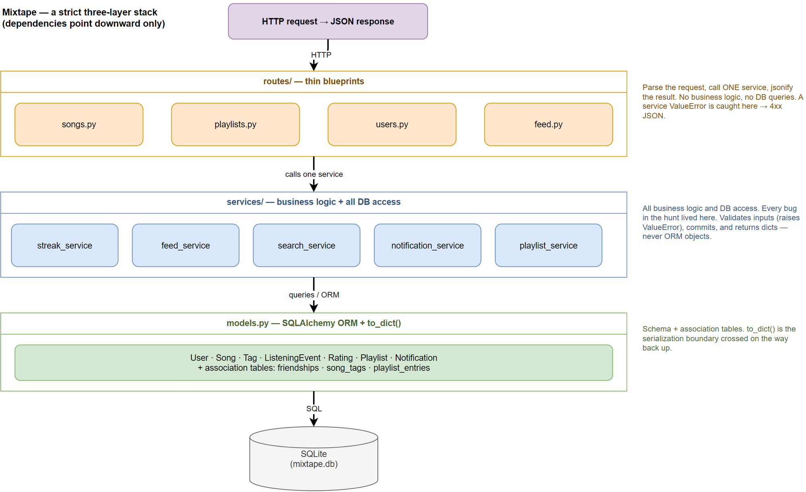

# Mixtape — Project 5 Submission

A codebase map for the Mixtape app: a Flask + SQLAlchemy JSON API where friends share songs,
rate them, build collaborative playlists, and see what each other is listening to.

The bug-hunt deliverable (find/fix/document the open issues) lives in **[BUG_REPORT.md](BUG_REPORT.md)**;
this document is the whole-project map. All six bugs found during the hunt are fixed on `main`;
`pytest tests/` reports **31 passed**.

---

## AI usage (read this first)

I used an AI assistant (Claude Code) throughout this project. This section is an honest account of
*how* — including where it was wrong — because the collaboration is the point, not a claim that I
did it alone. (§9–§11 go deeper on the workflow; this is the summary.)

**What I asked the AI to do:**

- **Trace call chains.** "Which endpoint records a listen, and what does it call?" → it followed
  `app.py` blueprint prefixes into `routes/songs.py` → `record_listening_event` → `update_listening_streak`.
  This was its strongest use: fast multi-file navigation to the ~5 candidate service functions.
- **Explain specific code I had already located.** e.g. "what does `today.weekday() != 6` do here?"
  (it's the Sunday guard), "what governs the 'recent' window?" (`RECENT_THRESHOLD`), "what does
  `playlist.songs.append` insert?" (a `playlist_entries` row).
- **Summarize / draft.** The codebase map (§1–§2), commit messages, the test scaffolding, and
  early drafts of this document.

**What it genuinely helped me understand:**

- The Mixtape layering — thin routes, service-owned logic — which is *why* every bug lived in
  `services/` and how to navigate by following the action (§8).
- SQLAlchemy specifics I'd have had to look up: how a many-to-many `outerjoin` fans out one row
  per tag, and that association tables with extra NOT-NULL columns can't be populated by a bare
  relationship `.append()`.

**Where I had to verify myself, and where the AI was wrong or incomplete:**

- **Issue #3 — the AI's explanation pointed me in the wrong direction.** Reading the un-deduplicated
  `outerjoin`, it confidently concluded "this returns duplicate rows, so search shows duplicates."
  That's *plausible but false.* When I ran the query myself, the DB returned 3 rows for a 3-tag
  song but the code returned **1** — SQLAlchemy's legacy `Query` silently de-dups entities, so the
  bug is **latent**, not active. Only executing it revealed this; the fix and its commit message
  are framed as *hardening* because of what I found, not what the AI first said.
- **Issue #6 — the AI didn't find it at all.** Reading `add_to_playlist`, it (and I) judged the
  code plausible. The `IntegrityError` surfaced only when I *wrote a test that actually called the
  function*. Reading never would have caught it.
- **Every "confirmed" verdict is mine, backed by a run** — a failing/passing test or a throwaway
  script — never by the assistant's assertion. Findings I couldn't confirm are labeled honestly
  (Issue #3 as "latent").

**The takeaway that shaped my workflow:** the AI was reliable for *navigation and explaining code
I'd already found*, and unreliable for *conclusions about runtime behavior*. So the loop was:
**I find the suspicious code → AI helps me understand it → I verify by reading and running it
myself.** Asking the AI to "find the bug" cold reliably produced plausible-but-wrong answers.

---

## 1. Main files and what each does

| File | Responsibility |
|------|----------------|
| `app.py` | **Application factory.** `create_app(config=None)` builds the Flask app, configures the SQLite DB, and registers the four blueprints under `/songs`, `/playlists`, `/users`, `/feed`. Owns the shared `db = SQLAlchemy()` instance imported everywhere else. |
| `models.py` | **Data model.** All SQLAlchemy models (`User`, `Song`, `Tag`, `ListeningEvent`, `Rating`, `Playlist`, `Notification`) plus three association tables (`friendships`, `song_tags`, `playlist_entries`). Every model has a `to_dict()` for JSON serialization. |
| `routes/songs.py` | Song endpoints: search, get detail, rate, and record a listen. |
| `routes/playlists.py` | Playlist endpoints: create, get metadata, list songs, add a song. |
| `routes/users.py` | User endpoints: profile, streak, list/read notifications. |
| `routes/feed.py` | Feed endpoints: "friends listening now" and the general activity feed. |
| `services/streak_service.py` | Listening-streak logic + recording listening events (the write side of the feed). |
| `services/feed_service.py` | Builds the "friends listening now" and activity feeds (the read side). |
| `services/search_service.py` | Song search by title/artist, with tags. |
| `services/notification_service.py` | Creating/retrieving notifications, rating songs, and adding songs to playlists (both of which notify the song's original sharer). |
| `services/playlist_service.py` | Playlist creation and ordered song retrieval. |
| `seed_data.py` | Drops/recreates all tables and populates realistic test data (5 users with friendships, 25 songs, 3 playlists, listening events, notifications). Run with `python seed_data.py`. |
| `tests/` | Pytest suites (one per service area) using an in-memory SQLite DB. `test_streaks`, `test_search`, `test_playlists`, `test_feed`, `test_notifications`. |
| `CLAUDE.md` | Orientation doc for AI coding assistants. |
| `BUG_REPORT.md` | The bug-hunt findings, root causes, and a Mermaid route→service→model dependency graph. |

---

## 2. Architecture: a strict three-layer stack

The app is organized into three layers with a clean, one-directional dependency flow:

```
HTTP request
   │
   ▼
routes/  ──►  services/  ──►  models.py  ──►  db (SQLite)
(thin)        (business logic)   (ORM)
```



*Source: [`architecture.drawio`](architecture.drawio) (editable in draw.io; [`architecture.svg`](architecture.svg) for a vector copy).*

- **`routes/` (blueprints)** are deliberately *thin*. Each handler parses the request, calls
  exactly one service function, and `jsonify`s the result. A `ValueError` raised by a service
  is caught and mapped to a `4xx` JSON error. **No business logic and no direct DB queries live
  in routes.**
- **`services/`** own all business logic and all database access. They validate inputs (raising
  `ValueError` on missing entities), run queries, mutate state, `commit()`, and return either
  ORM objects or plain dicts.
- **`models.py`** defines the schema and each model's `to_dict()`. Models don't reach up into
  services or routes.

This means: to understand any feature, find its route, see which service function it calls, and
read that function. To fix a behavior bug, you almost always edit `services/` — which is exactly
where all six bugs from the hunt lived.

---

## 3. Data flow: rating a song → notifying the sharer

This is the end-to-end path for one of the app's core social features (and the one Issue #4 was
about). Say **Darius rates a song that Nova shared**.


*Source: [`data-flow-rating.drawio`](data-flow-rating.drawio) (editable in draw.io; [`data-flow-rating.svg`](data-flow-rating.svg) for a vector copy).*

```
POST /songs/<song_id>/rate     body: { "user_id": <darius>, "score": 5 }
  │
  ▼  routes/songs.py :: rate()
     • pulls user_id + score from the JSON body
     • 400 if either is missing
     • calls rate_song(user_id, song_id, int(score))
  │
  ▼  services/notification_service.py :: rate_song(user_id, song_id, score)
     1. validate score is 1–5           → ValueError → 400
     2. db.session.get(Song, song_id)   → ValueError if missing
     3. db.session.get(User, user_id)   → ValueError if missing (this is the rater)
     4. look up an existing Rating for (user_id, song_id):
          • found  → update its score   (respects the unique (user_id, song_id) constraint)
          • absent → create a new Rating and add it
     5. db.session.commit()             → the rating is persisted
     6. if song.shared_by != user_id:   (don't notify yourself)
          └─► create_notification(
                  user_id=song.shared_by,          # Nova, the original sharer
                  notification_type="song_rated",
                  body="darius rated your song '<title>' 5/5.")
              └─► db.session.add(notification); db.session.commit()
  │
  ▼  back in the route: return rating.to_dict(), 201
```

Nova later fetches her notifications:

```
GET /users/<nova>/notifications  →  routes/users.py :: notifications()
  →  notification_service.get_notifications(user_id, unread_only=?)
     • query Notification WHERE user_id = nova ORDER BY created_at DESC
     • returns [n.to_dict() for n in ...]
```

Key points this illustrates:
- **Notifications are a write-time side effect**, created synchronously inside the action that
  triggers them (`rate_song`, and likewise `add_to_playlist`). There's no queue or background job.
- The **self-action guard** (`song.shared_by != actor`) is the shared pattern for "don't notify
  someone about their own action" — it appears identically in both `rate_song` and `add_to_playlist`.
- Notifications are **read on demand** via `get_notifications`, mirroring how the feed works.

### Companion flow: how a song reaches a friend's feed

The feed follows the same *write-then-read-on-demand* shape, split across two requests:

- **Write:** a friend listens → `POST /songs/<id>/listen` → `streak_service.record_listening_event`
  persists a `ListeningEvent` (and updates their streak).
- **Read:** you open your feed → `GET /feed/<id>/listening-now` → `feed_service.get_friends_listening_now`
  queries recent `ListeningEvent` rows from your friends (within a 30-minute window), keeps the
  most recent per friend, and serializes them.

There is no stored "feed" — it's derived from listening events at read time. (Full trace in the
README's *Data flow* section.)

---

## 4. Patterns I noticed

1. **Thin routes, fat services.** Every endpoint is a 5–15 line blueprint that delegates to one
   service call. Business logic never leaks into the HTTP layer. This makes services directly
   unit-testable without a request context — every test file calls service functions inside an
   `app.app_context()` rather than going through the HTTP client.

2. **Errors flow as `ValueError` → HTTP status.** Services signal "not found"/"bad input" by
   raising `ValueError`; routes uniformly translate that to a 400/404 JSON error. Services never
   import Flask or know about HTTP.

3. **`to_dict()` is the serialization boundary.** Services return dicts (or lists of dicts) built
   from model `to_dict()`s, never raw ORM objects, across the service→route boundary. Routes just
   `jsonify` what they get.

4. **Write-time side effects, read-on-demand derivation.** Notifications are created eagerly as a
   side effect of the triggering action; feeds and notification lists are computed lazily on read.
   Nothing is precomputed or cached.

5. **UUID string primary keys everywhere** (`generate_uuid`), so IDs are safe to expose in URLs and
   JSON without leaking row counts.

6. **Timezone-aware UTC, with a SQLite caveat.** Timestamps default to `datetime.now(timezone.utc)`.
   Because SQLite drops tz info on round-trip, `streak_service` re-attaches UTC
   (`.replace(tzinfo=timezone.utc)`) before comparing — a pattern to copy in any new time math.

7. **Association tables carry data, not just links.** `playlist_entries` has `position`,
   `added_by`, and `added_at`; `friendships` is stored **bidirectionally**. Because these tables
   have NOT-NULL extra columns, they must be populated with explicit inserts, not bare ORM
   `relationship.append()` — a subtlety that was the root of the sixth bug (`add_to_playlist`).

8. **Tests mirror the service layout.** One suite per service concern, each with its own in-memory
   DB fixture and a seed fixture — matching the "one service = one responsibility" structure.

---

## 5. How to run

```bash
pip install -r requirements.txt
python seed_data.py                       # populate the DB
FLASK_APP=app:create_app flask run        # serve the API
pytest tests/                             # 31 passed
```

---

## 6. Reflection: what a useful codebase map looks like

Writing this map (and using it to hunt six bugs) made clear that a *useful* map is not a
file-by-file inventory — a directory listing already gives you that. A useful map is the thing
that lets a newcomer **make a correct change on day one without reading every file.** Concretely:

1. **It answers "where does X live?" before you have to grep.** The single most valuable fact in
   this whole document is one sentence: *behavior bugs live in `services/`; routes are thin.*
   That one rule turns "read 14 files" into "read 1 service function." A good map front-loads the
   organizing principle so the reader can navigate by rule instead of by search.

2. **It traces at least one feature end-to-end.** Static structure ("here are the services") tells
   you what exists; a *data-flow trace* ("a rate request enters here, validates there, commits,
   then fires a notification as a side effect") tells you how the pieces actually talk. The
   rate→notify walkthrough in §3 is worth more than the file table in §1, because most real tasks
   are "change what happens when the user does X," and that's a flow, not a file.

3. **It names the invariants and gotchas, not just the components.** The genuinely useful entries
   are the ones you *can't* infer by skimming: `ValueError` is the error protocol between layers;
   `to_dict()` is the serialization boundary; SQLite silently drops timezone info; association
   tables have NOT-NULL columns that ORM `.append()` can't fill. Each of these is a landmine map —
   knowing them prevents a class of bug. (The last one *was* a bug — the sixth one.)

4. **It reflects reality, and stays honest about the messy parts.** A map that describes the
   intended design but hides the broken corners sends readers into traps. Where behavior surprised
   me (search de-dup being masked by the ORM; notifications not being wired to ratings), the map
   says so and links to [BUG_REPORT.md](BUG_REPORT.md) for depth. A map you can't trust is worse
   than none.

5. **It's layered by altitude.** Overview → file table → architecture diagram → one deep flow →
   patterns. A reader can stop at whatever depth answers their question. The point isn't to say
   *everything*; it's to say the ~20% that unlocks the other 80%, and to point (not copy) toward
   the detailed docs for the rest.

Short version: a useful codebase map is **navigational, not encyclopedic** — it teaches the rules
of the place, walks you through one real path, flags the tripwires, and trusts you to read the
code for the details.

> The contrast in one line: a *weak* map just lists files by name; a *useful* one says what each
> file does **and how they connect** — structurally (which layer calls which) and behaviorally
> (how data flows through a real request).

---

## 7. Root cause analysis — how each bug was reproduced

For each bug, the **"how I reproduced it"** field records the exact inputs, sequence of actions,
and data condition that triggered the reported behavior. (Full root causes and fixes are in
[BUG_REPORT.md](BUG_REPORT.md).)

> **Workflow note (AI usage).** Each entry follows the same discipline: *I* located the suspicious
> code first (by tracing the call chain — §8), then used AI to explain what that code does, then
> **verified the diagnosis by reading the code and running it myself.** The reverse order — asking
> AI to "find the bug" before reading the relevant code — reliably produces answers that are
> *plausible but wrong* (see Issue #3's `AI's role`). The **AI's role** line on each bug records
> where the assistant helped and where I did the verifying.

### Issue #1 — Listening streak keeps resetting

- **Buggy code path:** `POST /songs/<id>/listen` → `record_listening_event` → `update_listening_streak`, at the branch `elif days_since_last == 1 and today.weekday() != 6`.
- **Inputs:** a user with a non-null `last_listened_at`, plus a new listen exactly one calendar day later.
- **Sequence of actions:** (1) user listens on a **Saturday** — streak = N, `last_listened_at` = Saturday; (2) same user listens the next day, a **Sunday**.
- **Data condition that triggers it:** the new listen's date is a **Sunday** (`today.weekday() == 6`), evaluated in **UTC**, *and* the gap is exactly 1 day. The `and today.weekday() != 6` clause then short-circuits false, the increment is skipped, and control falls to `else: streak = 1`.
- **How I reproduced it:** reconstructed the original branch in a script and ran three consecutive-day transitions — `Mon→Tue` streak 1→2 ✅, `Sat→Sun` streak 1→**1** 🐛, `Sun→Mon` streak 1→2 ✅. Also confirmed by the pre-existing `test_streak_increments_on_sunday`, which failed `assert 1 == 2` before the fix.
- **Why it read as intermittent:** through the live API it only reproduces on an actual UTC Sunday (the code reads the wall clock), so it silently ate one day of streak per week.
- **AI's role:** after I isolated the `elif days_since_last == 1 and today.weekday() != 6` line, AI explained that `weekday() == 6` is Sunday and that the `and` clause therefore suppresses the increment. I verified by reading the branch and running the Sat→Sun transition — diagnosis confirmed against actual output, not taken on assertion.

### Issue #2 — "Friends Listening Now" shows people from yesterday

- **Buggy code path:** `GET /feed/<id>/listening-now` → `get_friends_listening_now`, which filters `ListeningEvent.listened_at >= now - RECENT_THRESHOLD` where `RECENT_THRESHOLD = timedelta(hours=24)`.
- **Inputs:** a viewer with at least one friend, and friend `ListeningEvent` rows whose `listened_at` is older than "a moment ago" but within the last 24 hours.
- **Sequence of actions:** (1) a friend listens to a song hours ago → a `ListeningEvent` is persisted; (2) the viewer requests `listening-now`; (3) that hours-old listen still appears, as if it were current.
- **Data condition that triggers it:** any friend event in the window `(now − 24h, now]`. A listen from, say, 5 hours ago passes the `>= now − 24h` filter and leaks into "now." The seed data supplies exactly this — recent events (10–20 min) *and* stale ones (2h–4.5 days).
- **How I reproduced it:** added a friend event ~5 hours old and called `get_friends_listening_now` — with the 24h window it was returned (the reported bug). After narrowing to `timedelta(minutes=30)`, I verified **both sides of the boundary**: a 29-min-old event is shown, a 31-min-old event is hidden, and `get_activity_feed` (which does *not* use the threshold) still returns the stale event — confirming the change is scoped to the intended feed.
- **AI's role:** after tracing the route to `get_friends_listening_now`, AI pointed to the module-level `RECENT_THRESHOLD` constant as the window governing "recent." I verified by reading the filter and running the 29-/31-minute boundary cases — the fix is a value change, confirmed by observation.

### Issue #3 — Same song shows up twice in search

- **Buggy code path:** `GET /songs/search?q=...` → `search_songs`, the `outerjoin(song_tags)` with no de-duplication.
- **Inputs:** a search query matching (title/artist ILIKE) a song that has **2 or more tags**.
- **Sequence of actions:** seed a multi-tag song (e.g. *"Crown Heights Anthem"*, 3 tags), then `GET /songs/search?q=Crown`.
- **Data condition that triggers it:** the matched song has ≥2 rows in `song_tags`. The join emits one row per tag: 0 tags → 1 row, 1 tag → 1 row, **3 tags → 3 rows**.
- **How I reproduced it (and why it's inconsistent):** ran the same filtered query three ways against a 3-tag song — underlying joined rows = **3**, legacy `Query.all()` (what the code uses) = **1**, 2.0 `select(...).scalars().all()` = **3**. The DB really produces duplicates, but SQLAlchemy's legacy `Query` de-duplicates full entities by identity, masking them. So the bug is **latent**: it surfaces only if results are consumed without entity-uniquing (selecting columns, adding a second entity, or migrating to `select()` without `.unique()`). That consumption-dependence is exactly why the duplicates were reported as inconsistent.
- **AI's role (the cautionary one):** reading the `outerjoin` with no `.distinct()`, AI's first-pass diagnosis was the *plausible but wrong* answer — "this returns duplicate rows, so search shows duplicates." Only by running the query myself did the real behavior appear: the ORM silently de-dups, so the bug is latent, not active. This is the case study for why the diagnosis must be verified by execution, not accepted because it sounds right.

### Issue #4 — Notified when a friend adds your song to a playlist, but not when they rate it

- **Buggy code path:** `POST /songs/<id>/rate` → `rate()` → `rate_song`. The function persists the `Rating` and commits, but there is **no `create_notification` call** — unlike its sibling `add_to_playlist` in the same module, which does notify.
- **Inputs:** a rater and a song shared by a *different* user.
- **Sequence of actions:** (1) Nova shares a song; (2) Darius rates it via `POST /songs/<id>/rate`; (3) Nova opens `GET /users/<nova>/notifications` — nothing is there.
- **Data condition that triggers it:** **no special condition** — every rate of another user's song fails to notify (deterministic). The one correct silence is rating your *own* song (`song.shared_by == user_id`), which should not notify.
- **How I reproduced it:** called `rate_song(darius, song, 5)` for a song shared by Nova, then `get_notifications(nova)` → **0** results, while the same setup routed through `add_to_playlist` produced **1**. That side-by-side contrast confirmed the missing side effect. After the fix, the rate produces one `song_rated` notification; re-rating (the upsert path) still notifies without error.
- **AI's role:** the symptom itself names two actions (playlist-add works, rate doesn't), so the trace was a **comparison**. Reading `add_to_playlist` and `rate_song` side by side in `notification_service.py` showed `create_notification` present in one and absent in the other. This is a case where tracing top-down (§10.4) mattered: the instinct "the notification code is broken" would send you into `create_notification`, which is fine — the bug is a *missing call*, not broken code.

### Issue #5 — Last song in a playlist never shows

- **Buggy code path:** `GET /playlists/<id>/songs` → `get_playlist_songs`, the `return [... for song in songs[:-1]]` slice.
- **Inputs:** any playlist id whose playlist contains **at least one song**.
- **Sequence of actions:** create a playlist, add ≥1 song (seed data builds playlists of 5–7 songs), then `GET /playlists/<id>/songs` and compare `count` to what was stored.
- **Data condition that triggers it:** **no special condition** — the `[:-1]` slice unconditionally drops the last ordered entry. Verified across sizes: 0 songs → `[]` (correct by accident), 1 song → `[]` (the only song dropped), 3 songs → `['Track1','Track2']` (last one missing).
- **How I reproduced it:** built playlists of 0/1/3 songs and applied the original slice; also caught immediately by `test_playlist_returns_all_songs` (returned 4, expected 5) and `test_playlist_returns_songs_in_order` (missing `Track 5`). This is the deterministic contrast to #1 and #3 — it fires on every request, no clock or tag state required.
- **AI's role:** minimal — once I read the `return [... for song in songs[:-1]]` line, the `[:-1]` is self-evidently the defect; no AI explanation was needed beyond confirming Python slice semantics. Verified by the two failing playlist tests. (A reminder that not every bug needs the assistant — the reading did the work here.)

### Issue #6 — `add_to_playlist` crashes on a new add (found via testing, not a user report)

- **Buggy code path:** `POST /playlists/<id>/songs` → `add_song()` → `add_to_playlist`, which did `playlist.songs.append(song)`. That inserts a `playlist_entries` row through the ORM relationship, but the association table has NOT-NULL `position` and `added_by` columns the append cannot supply.
- **Inputs:** a valid playlist, a valid song **not already in that playlist**, and an adder user.
- **Sequence of actions:** (1) create a playlist; (2) `POST` a genuinely new song to it; (3) the insert raises `sqlite3.IntegrityError: NOT NULL constraint failed: playlist_entries.position` — surfacing as an unhandled 500 (the route only catches `ValueError`).
- **Data condition that triggers it:** the song must be a **new add** (`song not in playlist.songs`). If the song is **already present**, the dedup guard skips the append and there is *no* crash — which is exactly why `seed_data.py` (which inserts `playlist_entries` rows manually) and the "re-add" path never hit it.
- **How I reproduced it:** it first appeared while writing `tests/test_notifications.py` — exercising `add_to_playlist` for a new song threw the `IntegrityError`. I then reproduced it in isolation with a three-line script (create playlist → `add_to_playlist(new_song)` → exception) to confirm it wasn't a test-setup artifact.
- **AI's role:** this bug was **not** found by reading — the code looked correct. It fell out of *writing a test that actually calls the function*. Once it threw, reading `models.py` connected the ORM `.append()` to the association table's NOT-NULL columns, pinpointing the cause. The fix uses an explicit `playlist_entries.insert()` that supplies `position = max + 1` and `added_by`.

---

## 8. Navigation strategy — tracing each symptom to its root cause

The same repeatable method found every bug, and it falls straight out of the app's architecture
(§2): **because routes are thin and services own the logic, you navigate by following the action,
not by grepping.**

> **The method:** symptom → name the *user action* behind it → find the **route** that handles
> that action (blueprint prefixes are registered in `app.py`) → read the thin route to learn which
> **service function** it calls → read that function and follow its internal calls → land on the
> defect. Consult `models.py` whenever a fix depends on a schema assumption.

Per bug, the files opened (in order) and what led from each to the next:

### Issue #1 — streak resets
1. `app.py` — action is "listening"; blueprint prefixes show song actions live under `/songs`.
2. `routes/songs.py` — found `POST /<song_id>/listen` → `listen()`, which calls `record_listening_event`.
3. `services/streak_service.py` — `record_listening_event` creates the event and delegates to `update_listening_streak`; reading that function exposed the suspicious `and today.weekday() != 6` in the consecutive-day branch.
4. `models.py` — confirmed `User.last_listened_at` is a nullable datetime, validating the branch logic.
- **Root cause:** the Sunday guard blocks a legitimate increment. **Fix:** drop `and today.weekday() != 6`.

### Issue #2 — feed shows yesterday
1. `app.py` → `routes/feed.py` — action is "view listening-now feed": `GET /<user_id>/listening-now` → `get_friends_listening_now`.
2. `services/feed_service.py` — the query filters `listened_at >= now - RECENT_THRESHOLD`; the constant is defined at the top of the module.
- **Root cause:** `RECENT_THRESHOLD = timedelta(hours=24)` — a day, not "now." **Fix:** `timedelta(minutes=30)`.

### Issue #3 — duplicate search results
1. `routes/songs.py` — action is "search": `GET /search` → `search_songs`.
2. `services/search_service.py` — the query `outerjoin`s `song_tags` with no de-dup.
3. `models.py` — confirmed `song_tags` is a many-to-many table (multiple rows per song) → classic join fan-out.
4. *Reading wasn't enough here:* ran the query directly to compare joined rows (3) vs returned results (1), revealing the ORM masks the fan-out — so the bug is latent.
- **Root cause:** un-deduplicated join. **Fix:** `.distinct()` to make one-row-per-song explicit.

### Issue #4 — no notification on rate
1. The symptom itself names **two actions to compare** — playlist-add (works) vs rate (doesn't).
2. `routes/songs.py` (`POST /<id>/rate` → `rate_song`) and `routes/playlists.py` (`POST /<id>/songs` → `add_to_playlist`) — both land in the same service.
3. `services/notification_service.py` — reading the two functions side by side: `add_to_playlist` calls `create_notification`; `rate_song` never does.
- **Root cause:** missing notification side effect in `rate_song`. **Fix:** add a `create_notification` call mirroring `add_to_playlist` (with the same self-action guard).

### Issue #5 — last playlist song missing
1. `routes/playlists.py` — action is "view playlist songs": `GET /<id>/songs` → `get_playlist_songs`.
2. `services/playlist_service.py` — the query orders by `position` correctly, but the return statement slices `songs[:-1]`.
- **Root cause:** off-by-one slice drops the last entry. **Fix:** iterate `songs`.

### Issue #6 — `add_to_playlist` crash (found via testing, not a user report)
1. Surfaced while writing `tests/test_notifications.py`: exercising `add_to_playlist` raised `IntegrityError: playlist_entries.position`.
2. `services/notification_service.py` — the add uses `playlist.songs.append(song)`.
3. `models.py` — the `playlist_entries` association table has NOT-NULL `position` and `added_by` columns the ORM append can't supply. Connecting the append to the schema pinpointed the cause.
- **Root cause:** ORM relationship append can't populate the association table's required columns. **Fix:** explicit `playlist_entries.insert()` with `position = max + 1` and `added_by`.

**What the traces have in common:** every root cause lived in `services/` (as the architecture
predicts), and `models.py` was the tie-breaker whenever the fix hinged on schema (nullable
timestamp for #1, many-to-many for #3, NOT-NULL association columns for #6). Two bugs (#3, #6)
could not be confirmed by reading alone — they required *running* a query/test to see the
behavior the ORM was hiding, which is the signal to stop reading and start executing.

---

## 9. AI tools during investigation

*(The top-of-document **AI usage** section is the summary; this section is the investigation-phase
detail.)*

This investigation was carried out with **Claude Code** (an agentic CLI assistant) as the AI
tool. Being explicit about *how* it was used — and where it was wrong — is part of the honesty of
the writeup.

**Where it helped:**

- **Navigation.** Reading `app.py` blueprint prefixes and following each route → service call
  chain (the §8 method) is exactly the kind of multi-file tracing an AI assistant does quickly.
  It located the five candidate service functions fast.
- **Empirical harnesses.** Rather than trust the model's read of the code, it wrote throwaway
  scripts to *execute* the suspect paths: reconstructing the original streak branch to confirm the
  Sat→Sun reset (#1), and comparing joined-row counts across query-consumption styles for search (#3).
- **Test authoring and running.** It ran `pytest` for a baseline (3 failed, 10 passed), and wrote
  the two missing suites (`test_feed`, `test_notifications`) — the latter is what surfaced the
  sixth bug.
- **Drafting.** Fixes, atomic commit messages, and this document.

**Where AI reasoning was wrong and execution corrected it — the important part:**

- For **Issue #3**, the model's first-pass conclusion (from reading alone) was "the un-deduplicated
  `outerjoin` produces duplicate rows, so search returns duplicates." Running the query showed the
  opposite: the DB emits 3 rows but SQLAlchemy's legacy `Query` de-dups entities to 1, so no
  duplicate ever reaches the user. The bug is **latent**, not active. A confident-sounding but
  wrong read was caught only because the claim was executed, not trusted.
- The **sixth bug** (`add_to_playlist` `IntegrityError`) was not predicted by reading the code as
  correct-looking; it fell out of *writing a test that actually calls the function*.

**Guardrails applied:**

- Every "confirmed" verdict is backed by a run (a failing/passing test or a script), never by the
  model's assertion. Findings that couldn't be confirmed are labeled honestly (#3 as "latent").
- Fixes were kept minimal and scoped to each root cause; the out-of-scope sixth bug was flagged
  and initially left as documented `xfail` tests before being fixed only after explicit sign-off.
- All code changes were verified by the full suite (**31 passed**) before landing.

**The workflow that works (and the order matters):**

> **You find the suspicious code → AI helps you understand it → you verify the diagnosis by reading
> it (and running it) yourself.**

The ordering is the whole point. Asking AI to *find the bug* before you've read the relevant code
almost always lands you somewhere **plausible but wrong** — Issue #3 is the textbook case: the
model's cold read ("the join duplicates rows") sounded authoritative and was false. Inverting to
"I locate the code by tracing the call chain (§8), AI explains that specific code, I confirm by
reading and executing" is what kept every diagnosis honest. AI narrows and explains; it does not
get the final word on behavior.

**Takeaway:** the AI was most valuable for *navigation and scaffolding* (explaining code I'd
already located, writing harnesses and tests, drafting docs) and least trustworthy for
*conclusions about runtime behavior* — so verification was always mine to do, by reading and by
running.

---

## 10. Execution tracing strategies when you're stuck

When reading the code doesn't settle a diagnosis (Issues #3 and #6 both hit this point), stop
reading and start observing. Four techniques, ordered from cheapest to most involved, each with
how it applies to this app:

### 1. Print at the entry of the suspicious function
Confirm the function is even called, and with the inputs you expect — before theorizing about its
logic. For the streak bug, a temporary line at the top of `update_listening_streak` settles it
immediately:

```python
def update_listening_streak(user, now):
    print(f"[trace] streak={user.listening_streak} last={user.last_listened_at} "
          f"now={now} today.weekday()={now.date().weekday()}")   # remove before commit
```

Seeing `today.weekday()==6` on the failing run points straight at the Sunday guard. (Delete such
lines before committing.)

### 2. Isolate the function in a Python shell / script
Import the service and call it directly with controlled inputs — **faster than firing HTTP
requests and far easier to reason about**, because you skip routing, JSON, and the wall clock.
This is the technique this writeup relied on most:

```python
from app import create_app, db
app = create_app({"SQLALCHEMY_DATABASE_URI": "sqlite:///:memory:"})
with app.app_context():
    db.create_all()
    from services.search_service import search_songs
    print(search_songs("Crown"))          # #3: observe results directly
    from services.streak_service import update_listening_streak
    # pass an explicit `now` — reproduces the Sunday case without waiting for Sunday
```

Crucially, passing an explicit `now` sidesteps Issue #1's clock dependency entirely — you don't
have to wait for a real Sunday to reproduce it. This is exactly how the §7 reconstructions were run.

### 3. Check what the data actually looks like
Query the database directly instead of assuming. `flask shell` pushes an app context for you:

```bash
FLASK_APP=app:create_app flask shell
```
```python
>>> from models import Song, song_tags, ListeningEvent
>>> from app import db
>>> # #3: how many tag rows does a song actually have? (drives the join fan-out)
>>> db.session.query(song_tags).filter(song_tags.c.song_id == "<id>").count()
>>> # #2: what timestamps do the friends' listening events really have?
>>> [(e.user_id, e.listened_at) for e in db.session.query(ListeningEvent).all()]
```

Seeing the real row counts / timestamps replaces "the data is probably…" with fact — and reveals
whether the triggering state (multi-tag songs, stale events) is even present (see the seed-data
note under Issue #1's clock dependency).

### 4. Read the call chain top-down, not bottom-up
Start at the **route**, follow each call in order, and write down what each step returns — don't
jump to "the bug is probably in X." This is the §8 navigation method, and the discipline matters:
for Issue #4 the instinct might be "the notification code is broken," but tracing top-down
(`rate()` → `rate_song` → … → *no `create_notification` call at all*) shows the bug is a **missing**
step, not a broken one — something you'd miss by diving straight into `create_notification`.

**How these reinforce the §9 workflow:** techniques 1–3 are how you *verify a diagnosis by running
it yourself*, and technique 4 is how you *find the suspicious code first*. Together they're the
antidote to the "plausible but wrong" cold read — you never have to guess what the code does when
you can cheaply make it tell you.

---

## 11. The debugging loop: verify before you fix

Everything above (§8 navigation, §9 AI usage, §10 execution tracing) serves one loop:

> **read → form a hypothesis → verify by running the code with specific inputs → fix.**

The step that gets skipped under pressure is the third one, and skipping it is expensive:
**fixing before verifying almost always produces a fix for the wrong cause.** The fix might even
make the symptom go away by accident, which hides the fact that the diagnosis was wrong and leaves
the real cause to resurface later.

Two bugs in this project show why the *verify* step earns its place:

- **Issue #3 — verifying changed what the fix even *means*.** The hypothesis from reading was "the
  un-deduplicated join returns duplicates that reach the user." Fixing straight from that would
  have shipped `.distinct()` with the commit message *"fix duplicate search results"* — a fix for
  a cause that isn't real. Running the query first (technique §10.2) showed the ORM already
  de-dups, so the bug is **latent**. Same one-line fix, but now correctly framed as *hardening
  against a latent fan-out*, not repairing an active defect. The code change was identical; the
  understanding — and the honest writeup — was not.
- **Issue #4 — verifying pointed at a different function entirely.** The tempting hypothesis is
  "the notification code is broken," which sends you editing `create_notification`. Tracing the
  call chain top-down (technique §10.4) shows `create_notification` is fine — `rate_song` simply
  never calls it. Fixing before verifying would have hunted for a bug in perfectly correct code.

So the loop is not ceremony. The **verify** step is what tells you *which* code to change and
*why* — and in this project it repeatedly moved the fix, the commit message, or the target
function away from the first plausible guess.
